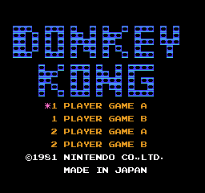
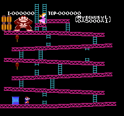

**NES Emulator**    

Links to research     
[6502 CPU](https://www.masswerk.at/6502/6502_instruction_set.html#layout-2-3  )   
[PPU](https://www.nesdev.org/wiki/PPU_memory_map)   
[PPU doc](https://www.nesdev.org/NESDoc.pdf#page=16)    
[PPU register](https://www.nesdev.org/wiki/PPU_registers)
[MapperXX to write](https://nesdir.github.io/mapper0.html)     
[Slides to quick understand of NES](https://slides.com/andsve/writing-a-nes-emulator#/85)      
[original NESDev.org](https://www.nesdev.org/NESDoc.pdf)      
[roms to test](https://wowroms.com/en/all-roms/list/consoles)     

## Samples    

